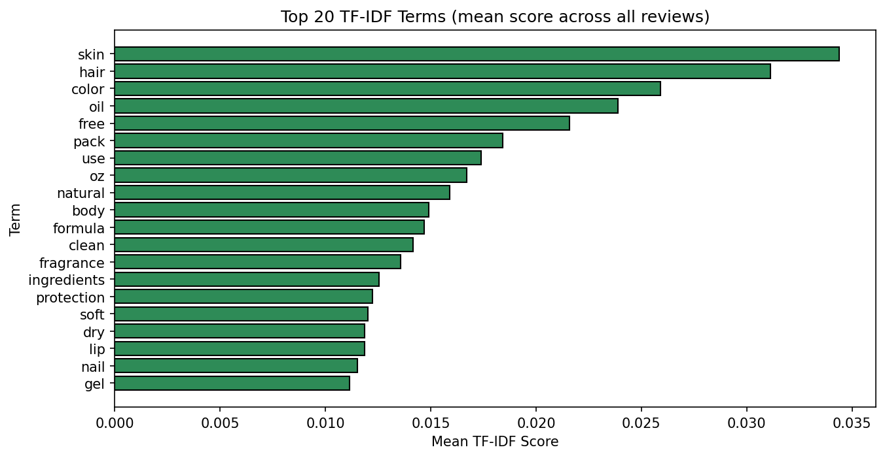
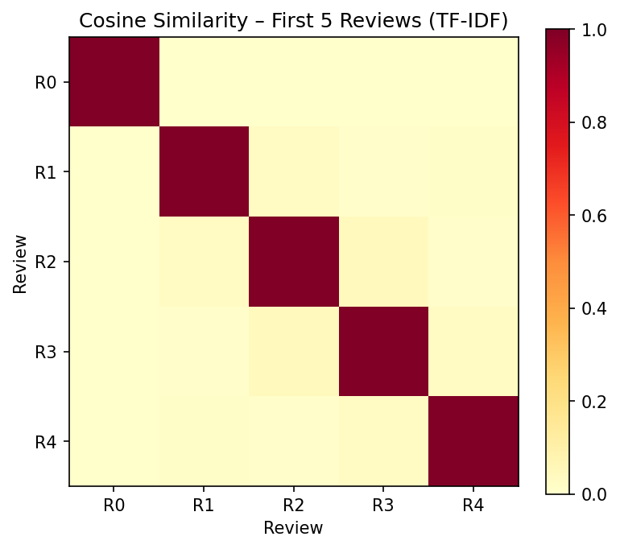
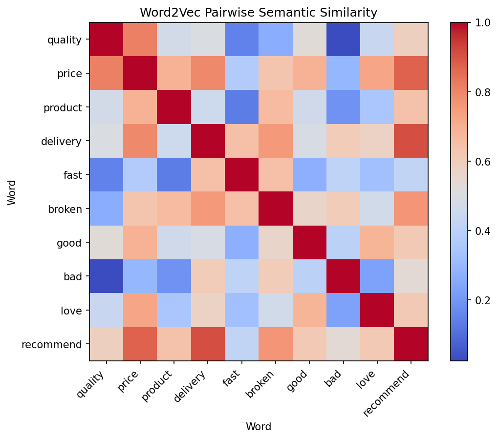
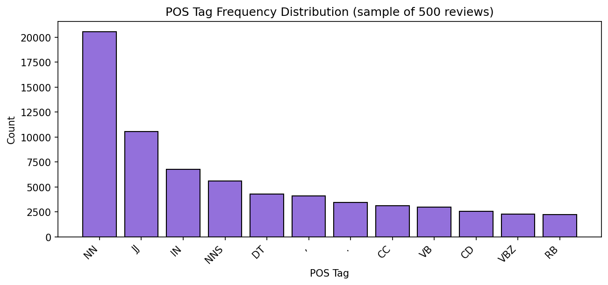
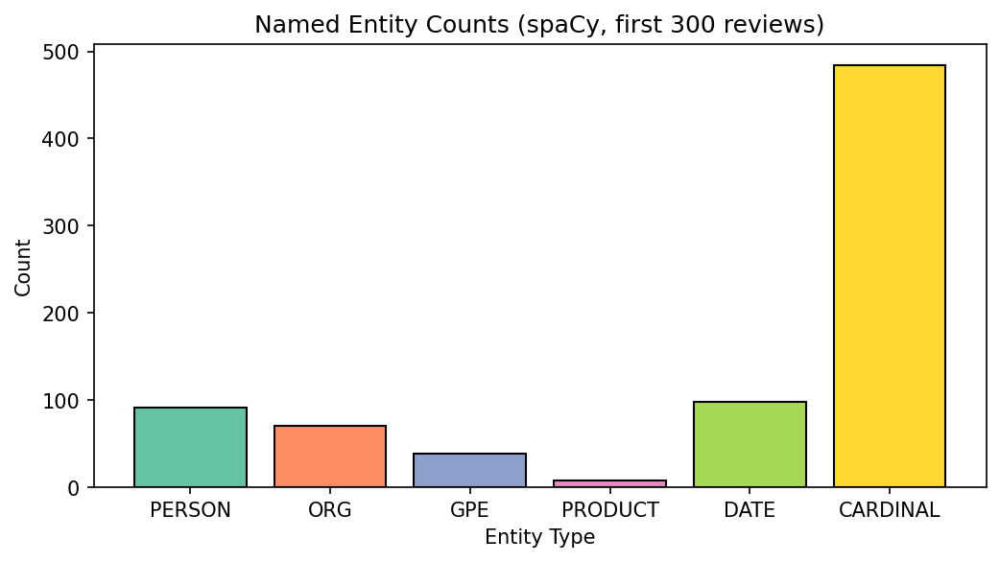
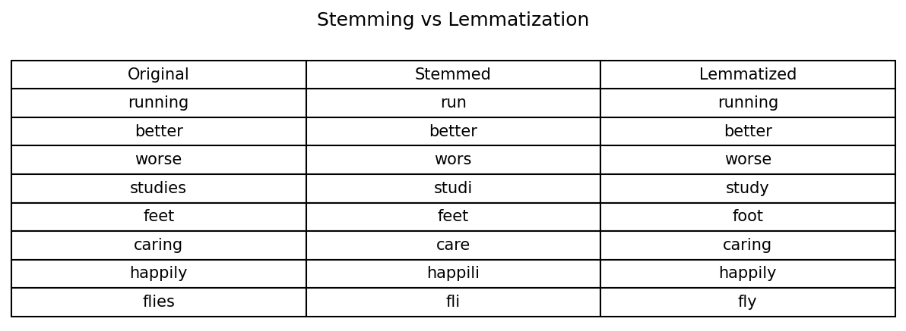
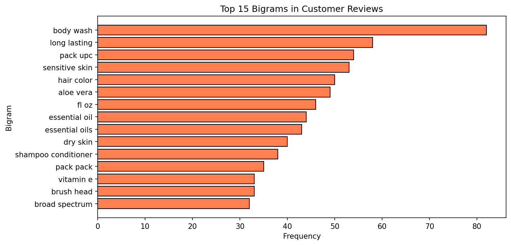
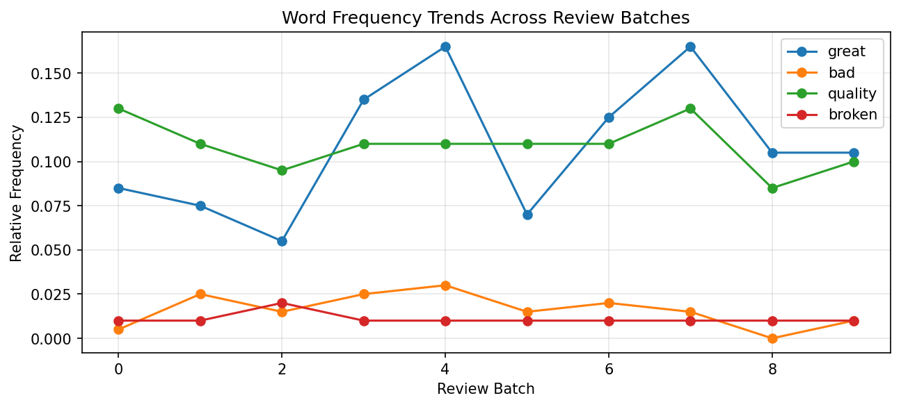

# NLP Pipeline – Customer Product Feedback System
** Natural Language Processing**
**Component B: Practical Implementation**
**Scenario 4: Customer Product Feedback System**

---

## Overview
This project implements a complete NLP pipeline applied to the **Walmart Product Reviews** dataset. The pipeline covers all required stages:

1. Text Pre-processing & Handling
2. Vectorization & Semantic Representation (BoW, TF-IDF, Word2Vec)
3. Grammatical Analysis & Parsing (POS, DCG, Dependency Parse, WordNet)
4. Information Extraction (NER, Time & Location)
5. Language Modelling (N-gram, Entropy, Perplexity, Text Generation)
6. Data Visualisation (10 output chart)

---

## Dataset
- **Name:** Walmart Product Reviews Dataset
- **Source:** [Kaggle](https://www.kaggle.com/datasets/promptcloud/walmart-product-review-dataset/data)
- **Size:** ~5,000 records
- **Format:** TSV (Tab-Separated Values)

---

## Setup & Installation

### Step 1 – Clone / download the project
Place all files in one folder.

### Step 2 – Install Python dependencies
```bash
pip install -r requirements.txt
```

### Step 3 – Download spaCy model
```bash
python -m spacy download en_core_web_sm
```

### Step 4 – Download the dataset
1. Go to https://www.kaggle.com/datasets/promptcloud/walmart-product-review-dataset/data
2. Download the TSV file
3. Rename it to `walmart_reviews.tsv`
4. Place it in the **same folder** as `nlp_pipeline.py`

### Step 5 – Run the pipeline
```bash
python nlp_pipeline.py
```

---

## Output
All output images are automatically saved to the `./output_images/` folder:

| File | Description |
|------|-------------|

| `02_stem_vs_lemma.png` | Stemming vs Lemmatization comparison table |
| `03_top20_words.png` | Top 20 most frequent words (lemmatized) |
| `04_tfidf_top20.png` | Top 20 TF-IDF terms |
| `05_cosine_similarity.png` | Cosine similarity heatmap (sample reviews) |
| `06_word2vec_similarity.png` | Word2Vec pairwise similarity heatmap |
| `07_pos_distribution.png` | POS tag frequency distribution |
| `08_ner_entity_counts.png` | NER entity type counts |
| `09_location_extraction.png` | Top locations from regex extraction |
| `10_bigram_frequency.png` | Top 15 bigrams |
| `12_word_trends.png` | Word frequency trends across review batches |

---

## Project Structure
```
project/
│
├── nlp_pipeline.py          ← Main Python script (run this)
├── walmart_reviews.tsv      ← Dataset (download from Kaggle)
├── requirements.txt         ← Python dependencies
├── README.md                ← This file
└── output_images/           ← Auto-created; all charts saved here
```

---

## Key Design Choices

### Pre-processing
- Regex cleaning removes URLs, HTML tags, and special characters
- Lemmatization preferred over stemming for customer feedback (preserves meaning)
- Custom stop-word list based on NLTK English corpus

### Vectorization
- **TF-IDF with bigrams** chosen over plain BoW to capture phrases like *"fast delivery"* and *"poor quality"* which are common in product reviews
- **Word2Vec** (100d, window=5) trained on the review corpus to capture product-domain semantics

### NER
- spaCy `en_core_web_sm` used for entity recognition
- Regex patterns added for time expressions and brand/location mentions not covered by spaCy

### Language Model
- Trigram MLE model with NLTK


## Sample Output Visualizations

The project generates several visual outputs to support the NLP analysis. Some examples are shown below.

### Top 20 Words


### TF-IDF Top 20 Words



### Cosine Similarity



### Word2Vec Similarity



### POS Tag Distribution



### Named Entity Recognition



### Stem vs Lemma 



### Location Extraction


### bigram_frequency



### word trends 


- Entropy and perplexity calculated manually for transparency

---

## Dependencies
See `requirements.txt`. Python 3.9+ recommended.
